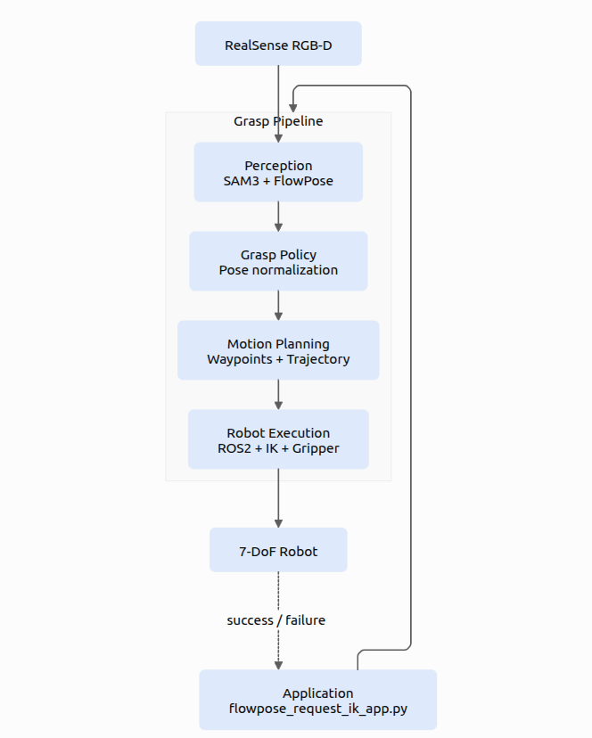

# everygrasp 目录说明

`grasp_core/` 是当前机器人抓取项目的主体代码包。一级目录只保留顶层包文件和说明文档，所有业务代码都放在二级功能目录中。


## 功能目录

| 目录 | 职责 |
|---|---|
| `apps/` | 应用入口、主循环、按键事件、资源生命周期 |
| `perception/` | RealSense、SAM3、FlowPose、感知结果收集 |
| `core/` | 位姿数据结构、坐标转换、四元数和几何工具 |
| `config/` | 命令行参数、默认值、YAML 配置读取 |
| `planning/` | 抓取目标位姿规划、tool.yaml waypoint 模板展开 |
| `motion/` | 轨迹插值和轨迹步长计算 |
| `communication/` | ROS2、IK target、夹爪 socket 等底层通信 |
| `tasks/` | 抓取、回 home、夹爪动作、失败恢复等任务执行 |
| `ui/` | OpenCV dashboard 和状态显示 |

## 入口链路

```text
flowpose_request_ik_tester.py
  -> grasp_core/apps/flowpose_request_ik_app.py
  -> grasp_core/tasks/robot_actions.py
  -> grasp_core/tasks/grasp_request_ik.py
  -> grasp_core/planning/ + grasp_core/motion/ + grasp_core/communication/
```

## 扩展规则

- 新增抓取、放置、分类任务：放到 `tasks/`
- 新增抓取姿态策略或模板解析：放到 `planning/`
- 新增轨迹插值、速度曲线、路径采样：放到 `motion/`
- 新增相机、分割模型、位姿估计模型：放到 `perception/`
- 新增 ROS topic、夹爪、机械臂通信：放到 `communication/`
- 新增共享位姿结构和坐标数学：放到 `core/`

每个通用能力只保留一个入口，其他模块只能调用，不再复制实现。

## 夹爪部分

- `daimon_stuff/dm_gripper_cam_py/` 腕部相机相关功能包
- `daimon_stuff/dm_gripper_tac_py/` 触觉传感器相关功能包；`daimon_stuff/tac.py` 是触觉入口。4个传感器启动规则如下
    |1
    |python daimon_stuff/tac.py --remote-addr 192.168.10.11:50052 --dev-id 2 --pc-host 192.168.10.123 --pc-port 60031
    |2
    |python daimon_stuff/tac.py --remote-addr 192.168.10.11:50051 --dev-id 0 --pc-host 192.168.10.123 --pc-port 60030
    |3
    |python daimon_stuff/tac.py --remote-addr 192.168.10.10:50052 --dev-id 2 --pc-host 192.168.10.123 --pc-port 60033
    |4
    |python daimon_stuff/tac.py --remote-addr 192.168.10.10:50051 --dev-id 0 --pc-host 192.168.10.123 --pc-port 60032
- `gripper/` 不再放 Python 文件，Daimon 相关入口统一放在 `daimon_stuff/`

直接按 L：双夹爪一起闭合。
先按 J 再按 L：只闭合左夹爪。
先按 H 再按 L：只闭合右夹爪。
# DaimonGeneral
